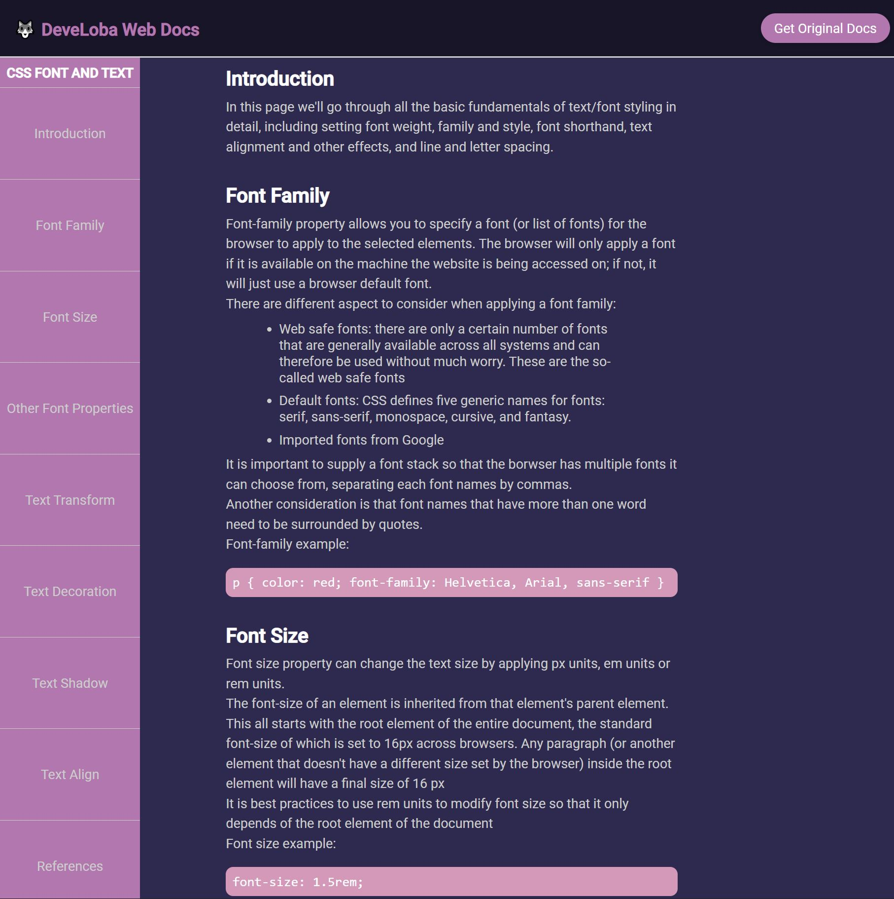

# FreeCodeCamp - Solution to Technical Documentation Page

This is a solution to the [Technical Documentation Page](https://www.freecodecamp.org/learn/2022/responsive-web-design/), which is a part of the Responsive Web Design certification.

## Table of contents

- [FreeCodeCamp - Solution to Technical Documentation Page](#freecodecamp---solution-to-technical-documentation-page)
  - [Table of contents](#table-of-contents)
  - [Overview](#overview)
    - [The challenge](#the-challenge)
    - [Screenshot](#screenshot)
    - [Links](#links)
  - [My process](#my-process)
    - [Built with](#built-with)
    - [What I learned](#what-i-learned)
  - [Author](#author)

## Overview

### The challenge

Build an app that is functionally similar to https://technical-documentation-page.freecodecamp.rocks

### Screenshot

### Links

- Live Site URL: [Online page]()

## My process

### Built with

- Semantic HTML5 markup
- CSS custom properties
- Flexbox
- CSS Grid
- Mobile-first workflow

### What I learned

I restyled the original documentation page of text and font styles from MDN web docs.  

## Author

- Twitter - [@develoba](https://www.twitter.com/develoba)
- Frontend Mentor - [@develoba](https://www.frontendmentor.io/profile/develoba)

