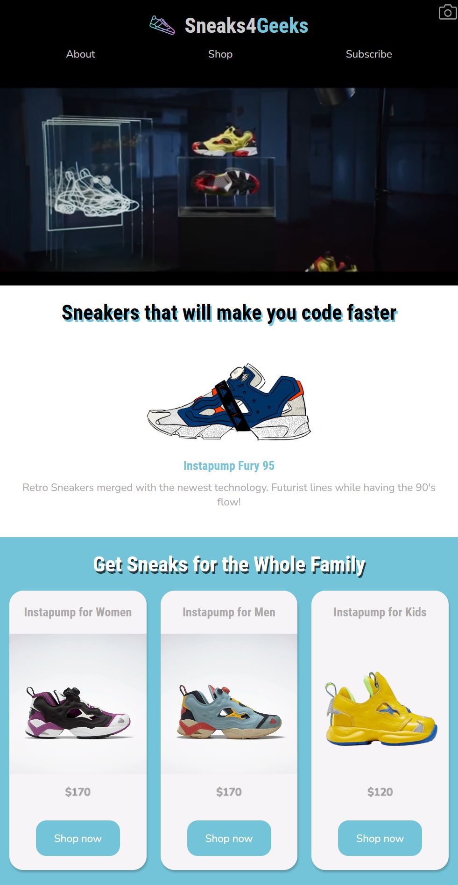

# FreeCodeCamp - Solution to Product Landing Page

This is a solution to the [Product Landing Page](https://www.freecodecamp.org/learn/2022/responsive-web-design/build-a-product-landing-page-project/build-a-product-landing-page), which is a part of the Responsive Web Design certification.

## Table of contents

- [FreeCodeCamp - Solution to Product Landing Page](#freecodecamp---solution-to-product-landing-page)
  - [Table of contents](#table-of-contents)
  - [Overview](#overview)
    - [The challenge](#the-challenge)
    - [Screenshot](#screenshot)
    - [Links](#links)
  - [My process](#my-process)
    - [Built with](#built-with)
  - [Author](#author)

## Overview

### The challenge

Build an app that is functionally similar to https://product-landing-page.freecodecamp.rocks

### Screenshot

### Links

- Live Site URL: [Online page](https://spontaneous-scone-b234b0.netlify.app/)

## My process

### Built with

- Semantic HTML5 markup
- CSS custom properties
- Flexbox
- CSS Grid
- Mobile-first workflow

## Author

- Twitter - [@develoba](https://www.twitter.com/develoba)
- Frontend Mentor - [@develoba](https://www.frontendmentor.io/profile/develoba)

